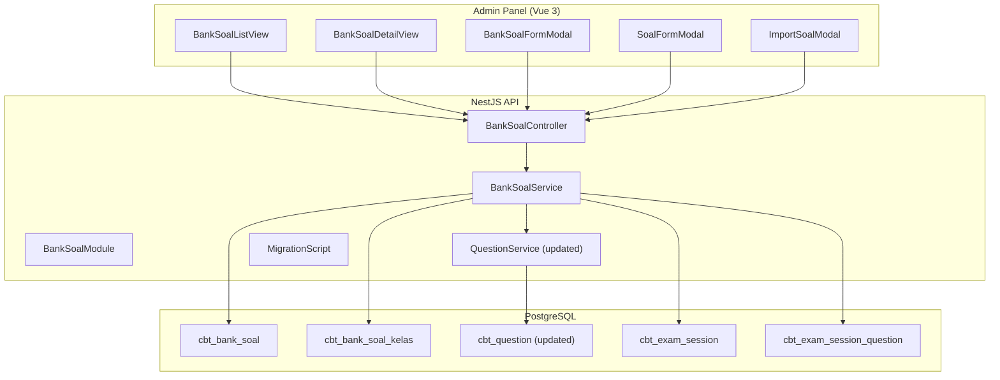
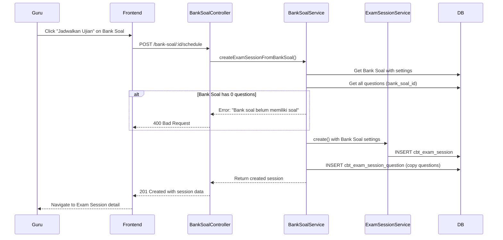
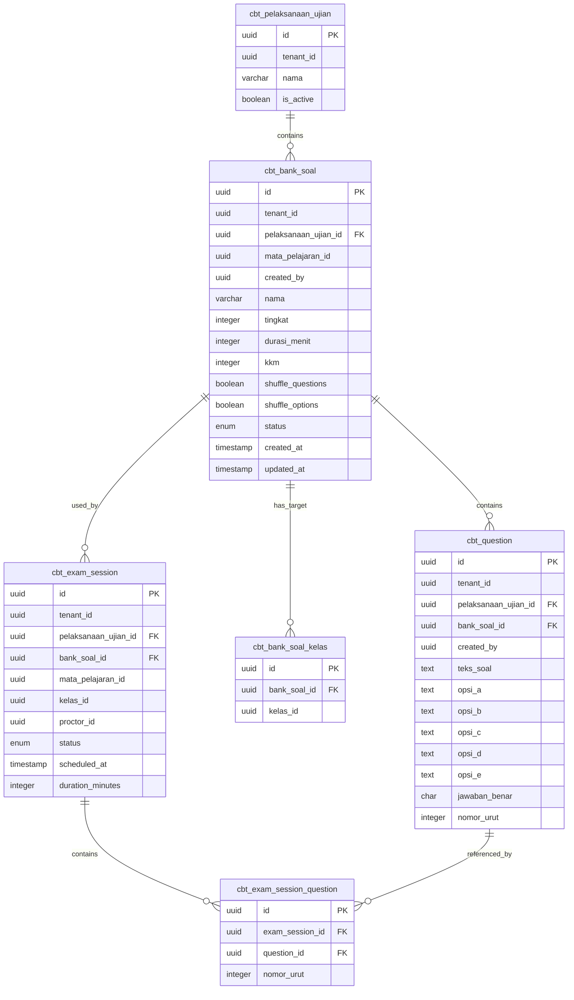

# Technical Design Document: Bank Soal Redesign

## Overview

Redesain arsitektur Bank Soal mengubah struktur data dari flat table (`cbt_question`) menjadi hierarki **Bank Soal → Soal** yang proper. Perubahan fundamental ini memisahkan metadata ujian (mata pelajaran, target kelas, durasi, KKM, shuffle options) dari soal individual ke entitas kontainer.

### Problem Statement

Struktur saat ini:
- Setiap `cbt_question` menyimpan `mata_pelajaran_id`, `tingkat`, `kelas_id` secara individual
- Metadata ujian (durasi, KKM, shuffle) tidak ada di level soal — hanya di `cbt_exam_session`
- Tidak ada konsep "kumpulan soal" yang bisa di-reuse untuk multiple sesi ujian
- UX buruk: guru harus mengisi metadata yang sama berulang kali per soal

### Solution

Memperkenalkan tabel `cbt_bank_soal` sebagai kontainer:
1. **Bank Soal** menyimpan metadata sekali (mata_pelajaran, target kelas, durasi, KKM, shuffle options)
2. **Soal** (cbt_question) mereferensi `bank_soal_id` dan mewarisi semua metadata
3. **Junction table** `cbt_bank_soal_kelas` untuk multi-select target kelas
4. **Sesi Ujian** mengambil soal dari Bank Soal, bukan membuat soal baru

### Key Changes

| Aspect | Before | After |
|--------|--------|-------|
| Question container | None (flat) | `cbt_bank_soal` table |
| Metadata location | Per-question | Per-bank-soal |
| Target kelas | Per-question (single) | Per-bank-soal (multi via junction) |
| Exam settings | Only in exam_session | Bank Soal has defaults, exam_session can override |
| Reusability | Questions scattered | Bank Soal can be used for multiple sessions |

## Architecture

### Component Diagram



### Data Flow: Create Sesi Ujian dari Bank Soal



## Components and Interfaces

### Backend Module Structure

```
apps/api/src/modules/bank-soal/
├── bank-soal.module.ts
├── bank-soal.controller.ts
├── bank-soal.service.ts
├── dto/
│   ├── create-bank-soal.dto.ts
│   ├── update-bank-soal.dto.ts
│   ├── list-bank-soal-query.dto.ts
│   ├── schedule-exam.dto.ts
│   └── index.ts
└── bank-soal.service.spec.ts
```

### API Endpoints

#### BankSoalController

| Method | Endpoint | Description | Auth |
|--------|----------|-------------|------|
| POST | `/bank-soal` | Create new Bank Soal | Guru (scoped) |
| GET | `/bank-soal` | List Bank Soal with filters | Guru (scoped) |
| GET | `/bank-soal/:id` | Get Bank Soal detail with soal list | Guru (scoped) |
| PATCH | `/bank-soal/:id` | Update Bank Soal settings | Guru (scoped) |
| DELETE | `/bank-soal/:id` | Delete Bank Soal (cascade soal) | Guru (scoped) |
| POST | `/bank-soal/:id/duplicate` | Duplicate Bank Soal | Guru (scoped) |
| POST | `/bank-soal/:id/schedule` | Create Exam Session from Bank Soal | Guru (scoped) |
| POST | `/bank-soal/:id/soal` | Add soal to Bank Soal | Guru (scoped) |
| PATCH | `/bank-soal/:id/soal/:soalId` | Update soal in Bank Soal | Guru (scoped) |
| DELETE | `/bank-soal/:id/soal/:soalId` | Delete soal from Bank Soal | Guru (scoped) |
| POST | `/bank-soal/:id/soal/import` | Bulk import soal from Excel | Guru (scoped) |
| GET | `/bank-soal/template` | Download Excel template | Guru |

### DTOs

#### CreateBankSoalDto

```typescript
export class CreateBankSoalDto {
  @IsString()
  @IsNotEmpty()
  @MaxLength(255)
  nama: string;

  @IsUUID()
  mataPelajaranId: string;

  @IsOptional()
  @IsInt()
  @Min(1)
  @Max(12)
  tingkat?: number;

  @IsOptional()
  @IsArray()
  @IsUUID('4', { each: true })
  targetKelasIds?: string[];

  @IsInt()
  @Min(5)
  @Max(360)
  durasiMenit: number;

  @IsInt()
  @Min(0)
  @Max(100)
  kkm: number;

  @IsBoolean()
  @IsOptional()
  shuffleQuestions?: boolean;

  @IsBoolean()
  @IsOptional()
  shuffleOptions?: boolean;
}
```

#### UpdateBankSoalDto

```typescript
export class UpdateBankSoalDto {
  @IsOptional()
  @IsString()
  @MaxLength(255)
  nama?: string;

  // mataPelajaranId is NOT updatable per requirements

  @IsOptional()
  @IsInt()
  @Min(1)
  @Max(12)
  tingkat?: number;

  @IsOptional()
  @IsArray()
  @IsUUID('4', { each: true })
  targetKelasIds?: string[];

  @IsOptional()
  @IsInt()
  @Min(5)
  @Max(360)
  durasiMenit?: number;

  @IsOptional()
  @IsInt()
  @Min(0)
  @Max(100)
  kkm?: number;

  @IsOptional()
  @IsBoolean()
  shuffleQuestions?: boolean;

  @IsOptional()
  @IsBoolean()
  shuffleOptions?: boolean;
}
```

#### ScheduleExamDto

```typescript
export class ScheduleExamDto {
  @IsDateString()
  scheduledAt: string;

  @IsUUID()
  kelasId: string; // Must be one of target kelas from bank soal

  @IsOptional()
  @IsUUID()
  proctorId?: string; // Defaults to current user
}
```

### Service Interfaces

#### BankSoalService

```typescript
interface BankSoalService {
  // CRUD
  create(tenantId: string, userId: string, dto: CreateBankSoalDto): Promise<BankSoal>;
  findAll(tenantId: string, userId: string, query: ListBankSoalQueryDto): Promise<PaginatedResult<BankSoal>>;
  findOne(tenantId: string, userId: string, id: string): Promise<BankSoalWithSoal>;
  update(tenantId: string, userId: string, id: string, dto: UpdateBankSoalDto): Promise<BankSoal>;
  remove(tenantId: string, userId: string, id: string): Promise<void>;
  
  // Operations
  duplicate(tenantId: string, userId: string, id: string): Promise<BankSoal>;
  scheduleExam(tenantId: string, userId: string, id: string, dto: ScheduleExamDto): Promise<ExamSession>;
  
  // Soal management
  addSoal(tenantId: string, userId: string, bankSoalId: string, dto: CreateSoalDto): Promise<Question>;
  updateSoal(tenantId: string, userId: string, bankSoalId: string, soalId: string, dto: UpdateSoalDto): Promise<Question>;
  removeSoal(tenantId: string, userId: string, bankSoalId: string, soalId: string): Promise<void>;
  importSoal(tenantId: string, userId: string, bankSoalId: string, file: Buffer): Promise<ImportResult>;
  
  // Helpers
  validateGuruScope(userId: string, tenantId: string, mataPelajaranId: string, kelasIds?: string[]): Promise<void>;
  checkBankSoalLocked(bankSoalId: string): Promise<boolean>;
  checkBankSoalUsedInAnySession(bankSoalId: string): Promise<boolean>;
}
```

### Frontend Components

```
apps/admin/src/views/cbt/
├── BankSoalListView.vue      # List bank soal with filters
├── BankSoalDetailView.vue    # Detail view with soal list
└── components/
    ├── BankSoalFormModal.vue   # Create/Edit bank soal
    ├── SoalFormModal.vue       # Create/Edit soal
    ├── ImportSoalModal.vue     # Excel import with preview
    ├── ScheduleExamModal.vue   # Schedule exam from bank soal
    └── BankSoalCard.vue        # Card for list view
```

## Data Models

### New Tables

#### cbt_bank_soal

```typescript
export const cbtBankSoalStatusEnum = pgEnum("cbt_bank_soal_status", [
  "draft",
  "ready",
  "archived",
]);

export const cbtBankSoal = pgTable(
  "cbt_bank_soal",
  {
    id: uuid("id").primaryKey().default(sql`gen_random_uuid()`),
    tenantId: uuid("tenant_id").notNull(),
    pelaksanaanUjianId: uuid("pelaksanaan_ujian_id")
      .notNull()
      .references(() => cbtPelaksanaanUjian.id),
    mataPelajaranId: uuid("mata_pelajaran_id").notNull(),
    createdBy: uuid("created_by").notNull(),
    
    nama: varchar("nama", { length: 255 }).notNull(),
    tingkat: integer("tingkat"), // NULL if using specific kelas
    durasiMenit: integer("durasi_menit").notNull(),
    kkm: integer("kkm").notNull().default(70),
    shuffleQuestions: boolean("shuffle_questions").notNull().default(false),
    shuffleOptions: boolean("shuffle_options").notNull().default(false),
    status: cbtBankSoalStatusEnum("status").notNull().default("draft"),
    
    createdAt: timestamp("created_at", { withTimezone: true })
      .notNull()
      .default(sql`NOW()`),
    updatedAt: timestamp("updated_at", { withTimezone: true })
      .notNull()
      .default(sql`NOW()`),
  },
  (table) => ({
    // Validations
    checkDurasi: check(
      "chk_bank_soal_durasi",
      sql`${table.durasiMenit} BETWEEN 5 AND 360`,
    ),
    checkKkm: check(
      "chk_bank_soal_kkm", 
      sql`${table.kkm} BETWEEN 0 AND 100`,
    ),
    // Indexes
    idxBankSoalTenant: index("idx_cbt_bank_soal_tenant").on(
      table.tenantId,
      table.pelaksanaanUjianId,
    ),
    idxBankSoalMapel: index("idx_cbt_bank_soal_mapel").on(
      table.tenantId,
      table.mataPelajaranId,
    ),
  }),
);
```

#### cbt_bank_soal_kelas (Junction Table)

```typescript
export const cbtBankSoalKelas = pgTable(
  "cbt_bank_soal_kelas",
  {
    id: uuid("id").primaryKey().default(sql`gen_random_uuid()`),
    bankSoalId: uuid("bank_soal_id")
      .notNull()
      .references(() => cbtBankSoal.id, { onDelete: "cascade" }),
    kelasId: uuid("kelas_id").notNull(), // FK to LMS kelas
  },
  (table) => ({
    uniqueBankSoalKelas: unique("uq_bank_soal_kelas").on(
      table.bankSoalId,
      table.kelasId,
    ),
    idxBankSoalKelas: index("idx_cbt_bank_soal_kelas").on(table.bankSoalId),
  }),
);
```

### Modified Tables

#### cbt_question (Updated)

```typescript
export const cbtQuestion = pgTable(
  "cbt_question",
  {
    id: uuid("id").primaryKey().default(sql`gen_random_uuid()`),
    tenantId: uuid("tenant_id").notNull(),
    pelaksanaanUjianId: uuid("pelaksanaan_ujian_id")
      .notNull()
      .references(() => cbtPelaksanaanUjian.id),
    
    // NEW: FK to bank_soal (nullable for migration period, then required)
    bankSoalId: uuid("bank_soal_id")
      .references(() => cbtBankSoal.id, { onDelete: "cascade" }),
    
    // DEPRECATED: these will be populated from bank_soal during migration
    // then removed in future cleanup
    mataPelajaranId: uuid("mata_pelajaran_id"), // Made nullable
    tingkat: integer("tingkat"),
    kelasId: uuid("kelas_id"),
    
    createdBy: uuid("created_by").notNull(),
    teksSoal: text("teks_soal").notNull(),
    gambarSoalUrl: varchar("gambar_soal_url", { length: 500 }),
    opsiA: text("opsi_a").notNull(),
    gambarAUrl: varchar("gambar_a_url", { length: 500 }),
    opsiB: text("opsi_b").notNull(),
    gambarBUrl: varchar("gambar_b_url", { length: 500 }),
    opsiC: text("opsi_c").notNull(),
    gambarCUrl: varchar("gambar_c_url", { length: 500 }),
    opsiD: text("opsi_d").notNull(),
    gambarDUrl: varchar("gambar_d_url", { length: 500 }),
    opsiE: text("opsi_e"),
    gambarEUrl: varchar("gambar_e_url", { length: 500 }),
    jawabanBenar: char("jawaban_benar", { length: 1 }).notNull(),
    nomorUrut: integer("nomor_urut").notNull().default(0),
    createdAt: timestamp("created_at", { withTimezone: true })
      .notNull()
      .default(sql`NOW()`),
    updatedAt: timestamp("updated_at", { withTimezone: true })
      .notNull()
      .default(sql`NOW()`),
  },
  (table) => ({
    // NEW: Index for bank_soal lookup
    idxQuestionBankSoal: index("idx_cbt_question_bank_soal").on(
      table.bankSoalId,
      table.nomorUrut,
    ),
    // Existing checks remain
    checkOptionE: check(
      "chk_question_option_e",
      sql`NOT (${table.opsiE} IS NULL AND ${table.jawabanBenar} = 'E')`,
    ),
    checkJawabanBenar: check(
      "chk_jawaban_benar",
      sql`${table.jawabanBenar} IN ('A','B','C','D','E')`,
    ),
    checkTeksSoal: check(
      "chk_teks_soal_length",
      sql`char_length(${table.teksSoal}) BETWEEN 1 AND 2000`,
    ),
    checkOpsiA: check(
      "chk_opsi_a_length",
      sql`char_length(${table.opsiA}) BETWEEN 1 AND 500`,
    ),
    checkOpsiB: check(
      "chk_opsi_b_length",
      sql`char_length(${table.opsiB}) BETWEEN 1 AND 500`,
    ),
    checkOpsiC: check(
      "chk_opsi_c_length",
      sql`char_length(${table.opsiC}) BETWEEN 1 AND 500`,
    ),
    checkOpsiD: check(
      "chk_opsi_d_length",
      sql`char_length(${table.opsiD}) BETWEEN 1 AND 500`,
    ),
    checkOpsiE: check(
      "chk_opsi_e_length",
      sql`${table.opsiE} IS NULL OR char_length(${table.opsiE}) BETWEEN 1 AND 500`,
    ),
  }),
);
```

### Entity Relationship Diagram



### Migration Strategy

#### Phase 1: Schema Migration (Non-Breaking)

```sql
-- 1. Create new tables
CREATE TABLE cbt_bank_soal (...);
CREATE TABLE cbt_bank_soal_kelas (...);

-- 2. Add bank_soal_id to cbt_question (nullable initially)
ALTER TABLE cbt_question 
  ADD COLUMN bank_soal_id UUID REFERENCES cbt_bank_soal(id) ON DELETE CASCADE;

-- 3. Add bank_soal_id to cbt_exam_session for reference
ALTER TABLE cbt_exam_session
  ADD COLUMN bank_soal_id UUID REFERENCES cbt_bank_soal(id);

-- 4. Make mata_pelajaran_id nullable in cbt_question (will be deprecated)
ALTER TABLE cbt_question 
  ALTER COLUMN mata_pelajaran_id DROP NOT NULL;

-- 5. Remove old scope check (tingkat OR kelas_id required)
ALTER TABLE cbt_question DROP CONSTRAINT IF EXISTS chk_question_scope;
```

#### Phase 2: Data Migration Script

```typescript
// apps/api/src/drizzle/migrations/migrate-to-bank-soal.ts

async function migrateToBankSoal(db: NodePgDatabase) {
  const logger = new Logger('BankSoalMigration');
  
  // Get all unique combinations of (pelaksanaan_ujian_id, mata_pelajaran_id, tingkat/kelas_id)
  const uniqueCombinations = await db.execute(sql`
    SELECT DISTINCT 
      pelaksanaan_ujian_id,
      tenant_id,
      mata_pelajaran_id,
      tingkat,
      kelas_id,
      created_by
    FROM cbt_question
    WHERE bank_soal_id IS NULL
  `);

  let bankSoalCount = 0;
  let questionCount = 0;

  for (const combo of uniqueCombinations.rows) {
    // Get mata pelajaran name for default naming
    const [mapel] = await db
      .select({ nama: mataPelajaran.nama })
      .from(mataPelajaran)
      .where(eq(mataPelajaran.id, combo.mata_pelajaran_id))
      .limit(1);

    const mapelNama = mapel?.nama ?? 'Unknown';
    
    // Generate default name
    let bankSoalNama: string;
    if (combo.kelas_id) {
      const [kelasRecord] = await db
        .select({ nama: kelas.nama })
        .from(kelas)
        .where(eq(kelas.id, combo.kelas_id))
        .limit(1);
      bankSoalNama = `Bank Soal ${mapelNama} - ${kelasRecord?.nama ?? 'Kelas'}`;
    } else {
      bankSoalNama = `Bank Soal ${mapelNama} - Tingkat ${combo.tingkat}`;
    }

    // Create Bank Soal
    const [bankSoal] = await db
      .insert(cbtBankSoal)
      .values({
        tenantId: combo.tenant_id,
        pelaksanaanUjianId: combo.pelaksanaan_ujian_id,
        mataPelajaranId: combo.mata_pelajaran_id,
        createdBy: combo.created_by,
        nama: bankSoalNama,
        tingkat: combo.tingkat,
        durasiMenit: 60, // Default
        kkm: 70, // Default
        status: 'draft',
      })
      .returning();

    bankSoalCount++;

    // If kelas-specific, add to junction table
    if (combo.kelas_id) {
      await db.insert(cbtBankSoalKelas).values({
        bankSoalId: bankSoal.id,
        kelasId: combo.kelas_id,
      });
    }

    // Update all matching questions with bank_soal_id
    const result = await db
      .update(cbtQuestion)
      .set({ bankSoalId: bankSoal.id })
      .where(
        and(
          eq(cbtQuestion.pelaksanaanUjianId, combo.pelaksanaan_ujian_id),
          eq(cbtQuestion.mataPelajaranId, combo.mata_pelajaran_id),
          combo.tingkat 
            ? eq(cbtQuestion.tingkat, combo.tingkat)
            : sql`${cbtQuestion.tingkat} IS NULL`,
          combo.kelas_id
            ? eq(cbtQuestion.kelasId, combo.kelas_id)
            : sql`${cbtQuestion.kelasId} IS NULL`,
          sql`${cbtQuestion.bankSoalId} IS NULL`,
        ),
      );

    questionCount += result.rowCount ?? 0;
  }

  logger.log(`Migration complete: ${bankSoalCount} bank soal created, ${questionCount} questions updated`);
  
  return { bankSoalCount, questionCount };
}
```

#### Phase 3: Post-Migration Cleanup (Future)

After verifying all data is migrated and new system is stable:

```sql
-- 1. Make bank_soal_id NOT NULL
ALTER TABLE cbt_question 
  ALTER COLUMN bank_soal_id SET NOT NULL;

-- 2. Drop deprecated columns from cbt_question
ALTER TABLE cbt_question 
  DROP COLUMN mata_pelajaran_id,
  DROP COLUMN tingkat,
  DROP COLUMN kelas_id;

-- 3. Drop old indexes
DROP INDEX IF EXISTS idx_cbt_question_bank;
DROP INDEX IF EXISTS idx_cbt_question_kelas;
```


## Correctness Properties

*A property is a characteristic or behavior that should hold true across all valid executions of a system—essentially, a formal statement about what the system should do. Properties serve as the bridge between human-readable specifications and machine-verifiable correctness guarantees.*

### Property 1: Guru Scope Filtering

*For any* Guru with a set of jadwal_pelajaran assignments, the available mata_pelajaran options and kelas options SHALL be exactly the set defined by those assignments, and the list of accessible bank soal SHALL contain only items where the mata_pelajaran is taught by that Guru OR the bank soal was created by that Guru.

**Validates: Requirements 1.2, 1.3, 4.1, 9.1, 9.2, 9.3, 9.4, 9.5**

### Property 2: Target Kelas Precedence

*For any* Bank Soal creation or update where both `tingkat` and `targetKelasIds` are provided, the system SHALL use only `targetKelasIds` as the target peserta and ignore `tingkat`. Conversely, when only `tingkat` is provided without specific `targetKelasIds`, the bank soal SHALL apply to all kelas in that tingkat.

**Validates: Requirements 1.4, 1.5**

### Property 3: Duration Validation

*For any* integer value provided as `durasiMenit`, the system SHALL accept only values in the range [5, 360] inclusive, and reject all values outside this range.

**Validates: Requirements 1.6, 5.2**

### Property 4: KKM Validation

*For any* integer value provided as `kkm`, the system SHALL accept only values in the range [0, 100] inclusive, and reject all values outside this range.

**Validates: Requirements 1.7, 5.2**

### Property 5: Bank Soal Creation Defaults

*For any* valid CreateBankSoalDto, the created Bank Soal record SHALL have `status = 'draft'` and `pelaksanaan_ujian_id` equal to the tenant's active pelaksanaan ujian.

**Validates: Requirements 1.8**

### Property 6: Answer E Requires Option E

*For any* Soal where `jawabanBenar = 'E'`, the system SHALL accept the soal only if `opsiE` is a non-empty string with length between 1 and 500 characters.

**Validates: Requirements 2.3**

### Property 7: Text Length Validation

*For any* string value provided as `teksSoal`, the system SHALL accept only strings with length in range [1, 2000]. *For any* string value provided as `opsiA`, `opsiB`, `opsiC`, `opsiD`, or `opsiE` (when provided), the system SHALL accept only strings with length in range [1, 500].

**Validates: Requirements 2.4, 2.5**

### Property 8: Soal Inherits Bank Soal Reference

*For any* Soal added to a Bank Soal, the created soal record SHALL have `bank_soal_id` equal to the parent Bank Soal's ID. *For any* update operation on an existing Soal, the `bank_soal_id` SHALL remain unchanged regardless of the update payload.

**Validates: Requirements 2.6, 2.7**

### Property 9: Delete Removes Record

*For any* valid delete operation on a Soal that is not locked, querying for that Soal after deletion SHALL return null/not found.

**Validates: Requirements 2.8**

### Property 10: Lock Mechanism

*For any* Bank Soal that is referenced by a cbt_exam_session with status in ['packaged', 'active', 'completed'], all edit and delete operations on that Bank Soal and its Soal SHALL be rejected with an appropriate error message.

**Validates: Requirements 2.9, 5.4**

### Property 11: Excel Parsing Round-Trip

*For any* valid set of question data, serializing to Excel format and then parsing back SHALL produce an equivalent set of question data (preserving teksSoal, opsiA-E, jawabanBenar, and nomorSoal).

**Validates: Requirements 3.1**

### Property 12: Excel Schema Validation

*For any* Excel file uploaded for import, the system SHALL validate that the required columns (nomor_soal, teks_soal, jawaban_benar, opsi_a, opsi_b, opsi_c, opsi_d) exist, and report missing columns as validation errors.

**Validates: Requirements 3.2**

### Property 13: Import Error Reporting

*For any* Excel file with invalid rows (empty teks_soal, invalid jawaban_benar, missing required opsi), the system SHALL return a list of errors where each error references the specific row number and the validation failure reason.

**Validates: Requirements 3.3**

### Property 14: Bulk Import Same Bank Soal ID

*For any* confirmed bulk import operation, all successfully created Soal records SHALL have the same `bank_soal_id` equal to the target Bank Soal's ID.

**Validates: Requirements 3.4**

### Property 15: Filter Returns Matching Results

*For any* list query with a filter (mataPelajaranId, tingkat, or search term), all returned Bank Soal items SHALL match the filter criteria. Specifically: if filtering by mataPelajaranId, all results have that mataPelajaranId; if filtering by tingkat, all results target that tingkat; if searching by name, all results contain the search term in their nama.

**Validates: Requirements 4.3, 4.4, 4.5**

### Property 16: Mata Pelajaran Immutability

*For any* update operation on a Bank Soal, if the request payload includes a different `mataPelajaranId` than the current value, the system SHALL reject the update with an appropriate error message.

**Validates: Requirements 5.3**

### Property 17: Update Changes Timestamp

*For any* successful update operation on a Bank Soal, the `updatedAt` timestamp after the update SHALL be greater than (more recent than) the `updatedAt` timestamp before the update.

**Validates: Requirements 5.5**

### Property 18: Cascade Delete

*For any* Bank Soal that is not referenced by any cbt_exam_session, deleting the Bank Soal SHALL also delete all Soal records where `bank_soal_id` equals the deleted Bank Soal's ID, resulting in zero Soal records with that bank_soal_id.

**Validates: Requirements 6.2**

### Property 19: Delete Protection

*For any* Bank Soal that is referenced by at least one cbt_exam_session (regardless of session status, including 'draft'), delete operations on that Bank Soal SHALL be rejected with an appropriate error message.

**Validates: Requirements 6.3**

### Property 20: Delete Audit Logging

*For any* successful Bank Soal deletion, an audit log record SHALL be created containing the deleted Bank Soal's ID/name and the count of Soal that were cascade deleted.

**Validates: Requirements 6.4**

### Property 21: Exam Session Inherits Settings

*For any* Exam Session created from a Bank Soal, the session SHALL have: `duration_minutes` equal to the Bank Soal's `durasi_menit`, `randomize_questions` equal to the Bank Soal's `shuffle_questions`, `randomize_options` equal to the Bank Soal's `shuffle_options`, `mata_pelajaran_id` equal to the Bank Soal's `mata_pelajaran_id`, and the count of cbt_exam_session_question records equal to the count of Soal in the Bank Soal.

**Validates: Requirements 7.2, 7.3, 7.4**

### Property 22: Migration Data Integrity

*For any* set of existing cbt_question records before migration, after running the migration script: (a) the count of created cbt_bank_soal records SHALL equal the count of unique (pelaksanaan_ujian_id, mata_pelajaran_id, tingkat, kelas_id) combinations, (b) every cbt_question SHALL have a non-null bank_soal_id, (c) every migrated cbt_bank_soal SHALL have `durasi_menit = 60` and `kkm = 70`, and (d) every migrated cbt_bank_soal name SHALL follow the pattern "Bank Soal {mata_pelajaran_nama} - Tingkat {X}" or "Bank Soal {mata_pelajaran_nama} - {kelas_nama}".

**Validates: Requirements 8.1, 8.2, 8.3, 8.4**

### Property 23: Duplication Preserves Data

*For any* Bank Soal duplication operation on a Bank Soal with N soal, the duplicated Bank Soal SHALL have: (a) nama equal to "{original_nama} (Copy)", (b) identical values for mataPelajaranId, tingkat, durasiMenit, kkm, shuffleQuestions, and shuffleOptions, (c) status equal to 'draft', (d) exactly N Soal records with content matching the original Soal but new IDs and the duplicated Bank Soal's bank_soal_id, and (e) identical target kelas entries in cbt_bank_soal_kelas.

**Validates: Requirements 10.1, 10.2, 10.3, 10.4**

## Error Handling

### API Error Responses

| Scenario | HTTP Status | Error Code | Message (ID) |
|----------|-------------|------------|--------------|
| No active pelaksanaan ujian | 404 | `NO_ACTIVE_PELAKSANAAN` | "Tidak ada pelaksanaan ujian aktif. Hubungi admin." |
| Guru tidak punya akses mata pelajaran | 403 | `FORBIDDEN_MATA_PELAJARAN` | "Anda tidak memiliki akses ke mata pelajaran ini" |
| Guru tidak punya akses kelas | 403 | `FORBIDDEN_KELAS` | "Anda tidak memiliki akses ke kelas ini" |
| Bank soal tidak ditemukan | 404 | `BANK_SOAL_NOT_FOUND` | "Bank soal tidak ditemukan" |
| Bank soal terkunci (ada sesi locked) | 409 | `BANK_SOAL_LOCKED` | "Bank soal tidak dapat diubah karena sudah digunakan dalam sesi ujian yang terkunci" |
| Bank soal tidak bisa dihapus | 409 | `BANK_SOAL_DELETE_BLOCKED` | "Bank soal tidak dapat dihapus karena sudah pernah digunakan dalam sesi ujian" |
| Soal tidak ditemukan | 404 | `SOAL_NOT_FOUND` | "Soal tidak ditemukan" |
| Soal terkunci | 409 | `SOAL_LOCKED` | "Soal tidak dapat diubah/dihapus karena bank soal sudah digunakan dalam sesi ujian yang terkunci" |
| Validasi durasi gagal | 400 | `INVALID_DURASI` | "Durasi ujian harus antara 5-360 menit" |
| Validasi KKM gagal | 400 | `INVALID_KKM` | "KKM harus antara 0-100" |
| Validasi opsi E gagal | 400 | `INVALID_OPTION_E` | "Jawaban benar tidak bisa E jika opsi E tidak diisi" |
| Validasi panjang teks soal gagal | 400 | `INVALID_TEKS_SOAL_LENGTH` | "Teks soal harus 1-2000 karakter" |
| Validasi panjang opsi gagal | 400 | `INVALID_OPSI_LENGTH` | "Setiap opsi harus 1-500 karakter" |
| Bank soal kosong saat schedule | 400 | `BANK_SOAL_EMPTY` | "Bank soal belum memiliki soal" |
| Kelas tidak dalam target bank soal | 400 | `INVALID_TARGET_KELAS` | "Kelas yang dipilih bukan target dari bank soal ini" |
| Excel format tidak valid | 400 | `INVALID_EXCEL_FORMAT` | "Format file Excel tidak valid" |
| Excel kolom tidak lengkap | 400 | `MISSING_EXCEL_COLUMNS` | "Kolom wajib tidak ditemukan: {missing_columns}" |
| Perubahan mata pelajaran ditolak | 400 | `MATA_PELAJARAN_IMMUTABLE` | "Mata pelajaran tidak dapat diubah" |

### Transaction Handling

All multi-step operations use database transactions:

1. **Create Bank Soal with target kelas**: Insert bank_soal → Insert bank_soal_kelas (within transaction)
2. **Delete Bank Soal**: Delete soal → Delete bank_soal_kelas → Delete bank_soal (cascade via FK)
3. **Duplicate Bank Soal**: Insert bank_soal → Insert bank_soal_kelas → Copy all soal (within transaction)
4. **Schedule Exam**: Insert exam_session → Insert exam_session_question (within transaction)
5. **Bulk Import**: Insert all soal (within transaction, all or nothing)

### Retry Strategy

For transient database errors:
- Connection errors: Retry up to 3 times with exponential backoff (100ms, 200ms, 400ms)
- Deadlock errors: Retry up to 2 times with 50ms delay
- Other errors: No retry, propagate to client

## Testing Strategy

### Unit Tests

Unit tests focus on specific examples, edge cases, and error conditions:

1. **DTO Validation Tests**
   - Valid CreateBankSoalDto accepted
   - Invalid durasi (4, 361) rejected
   - Invalid kkm (-1, 101) rejected
   - Missing required fields rejected

2. **Service Logic Tests**
   - `getGuruScope()` returns correct mata_pelajaran and kelas IDs
   - `validateGuruScope()` throws ForbiddenException for out-of-scope access
   - `checkBankSoalLocked()` returns true when session status is locked
   - `parseExcel()` correctly parses valid Excel files
   - `parseExcel()` returns row-level errors for invalid data

3. **Edge Case Tests**
   - Create bank soal when no active pelaksanaan ujian → NotFoundException
   - Delete bank soal with 0 soal → succeeds with audit log showing 0 soal
   - Duplicate bank soal with 0 soal → succeeds with empty duplicate
   - Schedule exam with kelasId not in target kelas → BadRequestException
   - Import Excel with all invalid rows → BadRequestException with all errors

### Property-Based Tests

Property-based tests validate universal properties across randomly generated inputs. Using **fast-check** library with minimum 100 iterations per test.

#### Test Configuration

```typescript
// apps/api/src/modules/bank-soal/__tests__/bank-soal.property.test.ts
import * as fc from 'fast-check';

const MIN_ITERATIONS = 100;

// Custom arbitraries for domain objects
const validBankSoalArb = fc.record({
  nama: fc.string({ minLength: 1, maxLength: 255 }),
  durasiMenit: fc.integer({ min: 5, max: 360 }),
  kkm: fc.integer({ min: 0, max: 100 }),
  shuffleQuestions: fc.boolean(),
  shuffleOptions: fc.boolean(),
});

const invalidDurasiArb = fc.oneof(
  fc.integer({ min: -1000, max: 4 }),
  fc.integer({ min: 361, max: 1000 }),
);

const validTeksSoalArb = fc.string({ minLength: 1, maxLength: 2000 });
const invalidTeksSoalArb = fc.oneof(
  fc.constant(''),
  fc.string({ minLength: 2001, maxLength: 3000 }),
);
```

#### Property Test Cases

```typescript
// Feature: bank-soal-redesign, Property 3: Duration Validation
describe('Property 3: Duration Validation', () => {
  it('should accept valid durasi values', () => {
    fc.assert(
      fc.property(
        fc.integer({ min: 5, max: 360 }),
        (durasi) => {
          const result = validateDurasi(durasi);
          return result.isValid === true;
        }
      ),
      { numRuns: MIN_ITERATIONS }
    );
  });

  it('should reject invalid durasi values', () => {
    fc.assert(
      fc.property(
        invalidDurasiArb,
        (durasi) => {
          const result = validateDurasi(durasi);
          return result.isValid === false;
        }
      ),
      { numRuns: MIN_ITERATIONS }
    );
  });
});

// Feature: bank-soal-redesign, Property 7: Text Length Validation
describe('Property 7: Text Length Validation', () => {
  it('should accept valid teksSoal lengths', () => {
    fc.assert(
      fc.property(
        validTeksSoalArb,
        (teksSoal) => {
          const result = validateTeksSoal(teksSoal);
          return result.isValid === true;
        }
      ),
      { numRuns: MIN_ITERATIONS }
    );
  });
});

// Feature: bank-soal-redesign, Property 11: Excel Parsing Round-Trip
describe('Property 11: Excel Parsing Round-Trip', () => {
  it('should preserve question data through serialize/parse cycle', () => {
    fc.assert(
      fc.property(
        fc.array(validSoalArb, { minLength: 1, maxLength: 50 }),
        (questions) => {
          const excel = serializeToExcel(questions);
          const parsed = parseExcel(excel);
          return questionsEqual(questions, parsed);
        }
      ),
      { numRuns: MIN_ITERATIONS }
    );
  });
});

// Feature: bank-soal-redesign, Property 15: Filter Returns Matching Results
describe('Property 15: Filter Returns Matching Results', () => {
  it('should return only items matching mataPelajaranId filter', () => {
    fc.assert(
      fc.property(
        fc.array(bankSoalArb, { minLength: 1, maxLength: 20 }),
        (bankSoalList) => {
          const targetMapelId = bankSoalList[0].mataPelajaranId;
          const filtered = filterByMataPelajaran(bankSoalList, targetMapelId);
          return filtered.every(b => b.mataPelajaranId === targetMapelId);
        }
      ),
      { numRuns: MIN_ITERATIONS }
    );
  });
});

// Feature: bank-soal-redesign, Property 23: Duplication Preserves Data
describe('Property 23: Duplication Preserves Data', () => {
  it('should preserve all settings in duplicated bank soal', () => {
    fc.assert(
      fc.property(
        validBankSoalWithSoalArb,
        async (original) => {
          const duplicate = await duplicateBankSoal(original);
          return (
            duplicate.nama === `${original.nama} (Copy)` &&
            duplicate.mataPelajaranId === original.mataPelajaranId &&
            duplicate.durasiMenit === original.durasiMenit &&
            duplicate.kkm === original.kkm &&
            duplicate.shuffleQuestions === original.shuffleQuestions &&
            duplicate.shuffleOptions === original.shuffleOptions &&
            duplicate.status === 'draft' &&
            duplicate.soal.length === original.soal.length
          );
        }
      ),
      { numRuns: MIN_ITERATIONS }
    );
  });
});
```

### Integration Tests

Integration tests verify end-to-end flows with real database:

1. **CRUD Flow Tests**
   - Create → Read → Update → Delete bank soal
   - Create bank soal → Add soal → Edit soal → Delete soal

2. **Scope Enforcement Tests**
   - Guru A cannot access Guru B's mata pelajaran
   - Guru A cannot see bank soal for kelas they don't teach
   - Access to out-of-scope bank soal returns 403

3. **Lock Mechanism Tests**
   - Create bank soal → Create exam session → Edit bank soal rejected
   - Create bank soal → Create exam session → Delete soal rejected
   - Create bank soal → Create exam session (draft) → Delete bank soal rejected

4. **Migration Tests**
   - Seed existing questions → Run migration → Verify bank soal created correctly
   - Verify all questions have bank_soal_id after migration
   - Verify naming convention followed

### Test File Structure

```
apps/api/src/modules/bank-soal/
├── __tests__/
│   ├── bank-soal.service.spec.ts       # Unit tests
│   ├── bank-soal.property.test.ts      # Property-based tests
│   └── bank-soal.integration.test.ts   # Integration tests
```
